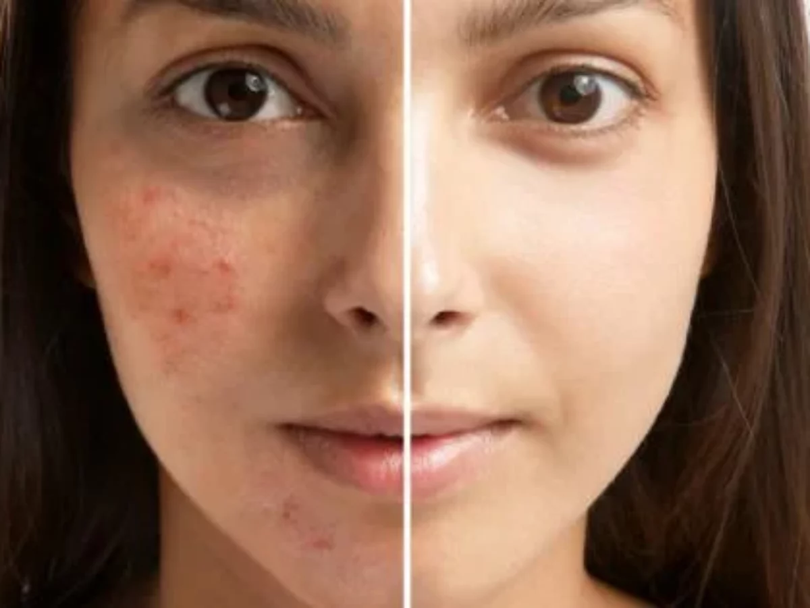
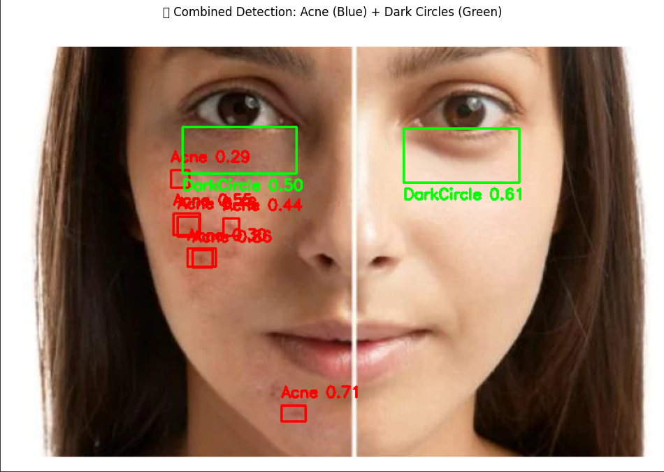

# Episcan-AI-Models
Episcan AI Models contains YOLOv8-based instance segmentation models for detecting acne and dark circles on facial images. Trained on Google Colab, the project showcases automated facial skin analysis for skincare and dermatology. Explore the models and notebooks for educational and research purposes.

## 🧠 Models Included

- **Acne Detection Model**  
  Detects and highlights acne spots on facial skin using instance segmentation.

- **Dark Circles Segmentation Model**  
  Identifies and segments dark circles under the eyes for targeted analysis.

Each model is trained separately and located in its own folder with a Colab notebook.

## 🚀 How to Use

These notebooks are intended for demonstration purposes only. Each one shows the complete training and evaluation process for the respective model using YOLOv8 in Google Colab.

If you'd like to replicate or adapt the work, feel free to explore the code and modify it with your own datasets.

## 📸 Sample Output

### Acne Detection
| Before | After |
|--------|-------|
|  |  |

*The output shows acne detection and dark circles segmentation using the trained YOLOv8 models.*

## 📍 Credits

This work is part of the Episcan project, developed for the purpose of facial skin issue detection. The models were trained using YOLOv8 on Google Colab. Feel free to explore and adapt the code to suit your needs.

Made by [Aman B Rajani] – [https://www.linkedin.com/in/aman-rajani]
